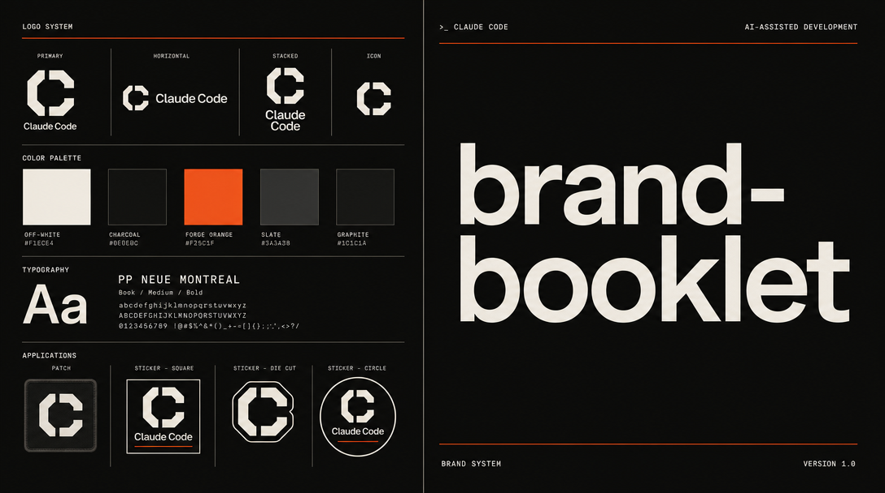

# brand-booklet



A [Claude Code](https://claude.ai/code) skill that generates a **complete brand system** from a brief — logos, patches, stickers, marketing visuals, style guide, and production-ready design tokens. Driven by strategy, not vibes.

> Strategy before pixels. Mode-routed intake. Asset generation driven by output medium.

---

## What it does

`brand-booklet` runs an 8-phase workflow that takes you from a raw idea to a fully documented brand system:

| Phase | What happens |
|---|---|
| **0 — Preflight & Mode Router** | Choose your mode: Scratch / Inspired / Rebrand / Optimize |
| **1 — Intake** | Mode-specific discovery questions — 10 for Scratch, targeted for others |
| **2 — Direction Setting** | 2–3 visual territories with real aesthetic tension; you pick one |
| **3 — Visual System** | LIFT analysis, 6-color palette, typography, shape language — locked before any image generation |
| **4 — Asset Manifest** | Output medium question filters the asset list (Landing / SaaS / E-Commerce / Social / Print / All) |
| **5 — Primary Logo** | Blocking gate — one subagent, gpt-image-2 T2I, 3 variants, you approve before anything else runs |
| **6 — Parallel Asset Generation** | Logo variants, patches, stickers, marketing visuals — all via Edit-Mode from the approved primary |
| **7 — Audit** | 8-point visual critique checklist per asset; auto-regeneration for failing assets |
| **8 — Documentation** | Brand-Booklet.md, Brand.md one-pager, design-system.md with 9 sections, AGENTS.md asset manifest |

**Output folder structure:**
```
./brand/
├── 00_plan.md          ← strategy + LIFT analysis
├── 00_review.md        ← visual critique scores
├── Brand-Booklet.md    ← complete brand guide (200+ lines)
├── Brand.md            ← one-pager for agents and devs
├── AGENTS.md           ← asset manifest + rules for downstream AI
├── design-system.md    ← production-ready CSS tokens + anti-patterns
├── 01_logos/           ← primary + all variants
├── 02_patches/         ← round, shield, wordmark patches
├── 03_stickers/        ← verb-trio sticker set
├── 04_marketing/       ← hero 16:9, square 1:1, story 9:16
├── 05_typography/      ← type system specification
└── 06_color/           ← tokens.json + palette visualization
```

---

## Four modes

```
1. SCRATCH    — New brand, no references. Needs direction-finding.
2. INSPIRED   — New brand, you have references (brands, designers, style wishes).
3. REBRAND    — Existing brand needs renewal. Preserve equity, remove drift.
4. OPTIMIZE   — Existing website. Brand assets need to align or fill gaps.
```

The mode router is the first question asked — it's what makes the intake sharp instead of generic.

---

## The LIFT System

Every brand decision runs through a four-dimensional framework before any image is generated:

| Dimension | Question |
|---|---|
| **L — Leverage-Asset** | What one element would people recognize if all other context was stripped away? |
| **I — Internal Rhythm** | What visual cadence runs consistently through all assets? |
| **F — Friction Sources** | What category clichés, AI tells, and mismatched energies must be actively avoided? |
| **T — Transferability** | How does the identity survive at 32px, inverted, 1-color, in print? |

---

## Image generation rules

**Model: `gpt-image-2` for everything — no exceptions.**

- **T2I** (no `--image_url`) — only for the very first asset (Primary Logo) when no reference exists yet
- **Edit-Mode** (`--image_url` with Primary Logo CDN URL) — for all other assets; coherence is non-negotiable

| Asset type | Quality | Why |
|---|---|---|
| Hero 16:9, OG Card, large marketing visuals | `high` | Displayed large — every pixel weakness is visible |
| Primary Logo (first T2I generation) | `high` | Anchor asset — all edits depend on it |
| All logo variants | `medium` | Edit-Mode, anchor is already set |
| Patches, stickers | `medium` | Small display sizes, print-ready at medium |
| Square 1:1, Story 9:16 | `medium` | Phone screen consumption, medium is sufficient |

---

## Prompt architecture

Every image prompt follows a strict 5-layer structure:

```
Layer 1 — SUBJECT:      What exactly is shown
Layer 2 — STYLE:        Visual language (vector-clean, flat 2D, geometric, etc.)
Layer 3 — COMPOSITION:  Layout and format
Layer 4 — LIGHT & MAT:  Material quality (matte, metallic, embroidered, etc.)
Layer 5 — NEGATIVE:     What must NOT appear
```

The `prompts/` folder contains fully worked examples for every asset type using a real brand ("Sentinel — B2B cybersecurity").

---

## Installation

This skill requires [Claude Code](https://claude.ai/code) with the Agent tool available.

**1. Clone into your Claude skills folder:**
```bash
git clone https://github.com/tillmannvey-spec/brand-booklet ~/.claude/skills/brand-booklet
```

**2. Install the `fal-media-generator` dependency:**

This skill requires `fal-media-generator` at `~/.claude/skills/fal-media-generator/` — it's the generation runtime that executes all image commands. Install it separately.

**3. Set your FAL API key:**
```bash
export FAL_KEY="your-key-here"
# Or set it permanently in your shell profile
```

Get a key at [fal.ai](https://fal.ai).

**4. (Optional) Install Python dependency:**
```bash
pip install fal-client
```

Required for uploading local files before Edit-Mode calls.

---

## Usage

In any Claude Code session:

```
/brand-booklet
```

Or naturally: *"Use the brand-booklet skill to create a brand for [company name]."*

Claude will:
1. Ask which mode fits your project
2. Run the mode-specific intake (10 questions for Scratch, targeted for others)
3. Present 2–3 visual territories — you pick one
4. Lock the visual system (colors, type, shape language) before touching any images
5. Ask what output medium the brand is for → filter the asset manifest
6. Generate the primary logo → **hard stop for your approval**
7. Spawn parallel subagents for all remaining assets
8. Audit every asset against an 8-point checklist
9. Write the full brand documentation

---

## What gets generated

### Per output medium

| Medium | Logos | Patches | Stickers | Marketing |
|---|---|---|---|---|
| Landing Page | primary, horizontal, vertical, monogram, favicon, dark | — | optional ×2 | hero 16:9, square, story, OG card |
| SaaS App | primary, monogram, favicon, app-icon, dark | — | — | square 1:1 |
| E-Commerce | primary, horizontal, monogram, favicon | round, wordmark | ×3 | hero, square, story |
| Portfolio | primary, monogram, signature, favicon | — | optional ×2 | square, story |
| Print | primary, horizontal, vertical, monogram, 1-color | round, shield, wordmark | ×3 | — |
| Social First | primary, square-locked, monogram, favicon | — | ×4 | square, story, profile |
| All | full set | full | full | full |

### Documentation files

| File | What it contains |
|---|---|
| `Brand-Booklet.md` | 200+ line brand guide: strategy, voice, logo system, color, type, patches/stickers, marketing, do/don't gallery, asset manifest |
| `Brand.md` | ≤80 line one-pager: mission, verb-trio, colors, type, canonical logo path, 3 hard rules |
| `design-system.md` | 9-section production spec: CSS custom properties, type scale, component patterns, animation, layout rules, anti-patterns list, Tailwind config, Google Fonts import |
| `AGENTS.md` | Asset inventory table, locked file list, regeneration rules for downstream AI agents |

---

## Folder reference

```
brand-booklet/
├── SKILL.md                     ← main workflow (8 phases)
├── references/
│   ├── prompt-patterns.md       ← 5-layer prompt structure + fal commands (always loaded)
│   ├── design-knowledge.md      ← LIFT system, 12 grid archetypes, verb families, AI anti-patterns
│   └── booklet-template.md      ← Brand-Booklet.md skeleton (filled in Phase 8)
├── scripts/
│   └── build_asset_index.py     ← scans ./brand/, reads .meta.json, outputs AGENTS.md table
├── templates/
│   ├── critique-checklist.md    ← 8-point visual audit checklist
│   └── agents-md-template.md    ← AGENTS.md skeleton
└── prompts/
    ├── logo-primary.md          ← worked example: primary logo (Sentinel cybersecurity brand)
    ├── logo-vertical.md         ← worked example: vertical variant via Edit-Mode
    ├── patch.md                 ← worked example: round + shield patches
    ├── sticker.md               ← worked example: verb-trio sticker set
    └── marketing-visual.md      ← worked example: hero, square, story formats
```

---

## Skill integrations

| Skill | When used |
|---|---|
| `fal-media-generator` | Every image generation step — core dependency |
| `brand-auditor` | Phase 7: quality audit (optional, runs inline if not installed) |
| `impeccable:bolder` | Phase 7 escalation when assets score technically pass but feel flat |
| `claude-design-clone` | Optional Phase 1: extract design tokens from competitor website |

---

## Production notes

- AI-generated logo outputs are visual starting points
- Final production logos should be vectorized in Figma or Illustrator before commercial print
- Patches: deliver PNG to embroidery vendor for digitization (they handle thread mapping)
- Stickers: PNG with white stroke = die-cut border → send directly to kiss-cut sticker vendors
- `design-system.md` is consumed by `frontend-design`, `design-html`, `landing-page-design` skills downstream

---

## Asset versioning

- `_v1` files are approved and locked — never overwrite
- New iterations use `_v2`, `_v3` suffix
- Every generated file gets a sibling `.meta.json` with `{prompt, model, date}`

---

*Made for [Claude Code](https://claude.ai/code). Requires fal.ai for image generation.*
